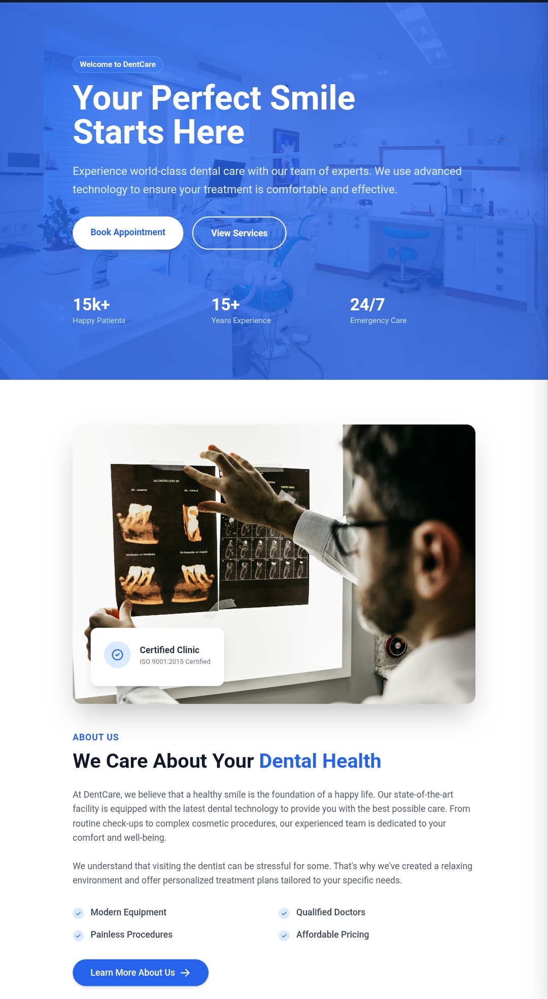
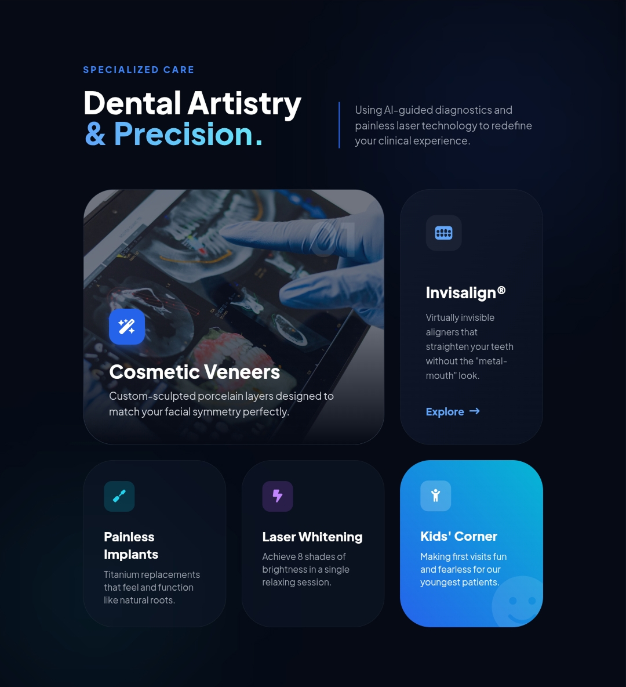

# 🚀 Tailwind UI & Dental Themes for Laravel

### Created by **Nikul Prajapati**

A modern collection of **Tailwind CSS UI components**, **Glass UI elements**, and **industry-ready Laravel Blade themes**.
Designed for **speed, SEO, and developer productivity**.

Perfect for developers building **landing pages, SaaS dashboards, and healthcare websites**.

---

# ✨ Features

* ⚡ Built with **Laravel Blade**
* 🎨 Modern **Tailwind CSS UI components**
* 🧊 **Glassmorphism UI Kit**
* 🦷 Ready **Dental Clinic Theme**
* 📱 Fully **Responsive Design**
* 🚀 **SEO optimized layout**
* 🎥 **Swiper.js sliders**
* ✨ Smooth animations and gradients
* 🎭 Canvas animations

---

# 🧊 Glass UI Kit

This project also includes a **modern Glassmorphism UI Kit** built with Tailwind CSS.

Perfect for creating **futuristic dashboards, landing pages, SaaS apps, and healthcare websites**.

### Glass UI Example

```html
<div class="bg-white/10 backdrop-blur-xl border border-white/20 rounded-2xl shadow-lg p-6">
    Glass UI Card
</div>
```

---

# 🧩 Components Included

This repository contains a growing collection of **reusable UI sections and interactive components**.

---

## 🪪 Cards

* Stat card with **animated progress bar & trend badge**
* Profile card with **gradient avatar ring & social stats**
* Notification card with **live alerts**

---

## 🎛 Controls

* Glass **search input with focus glow**
* **Interactive dropdown** with icon options
* **Toggle switches** with smooth animation
* **Range slider** with violet glowing thumb

---

## 🎧 Media Player

* Animated **spinning disc**
* **Live waveform bars animation**
* Playback controls with **gradient play button**

---

## 🧱 UI Elements

* **4 Button variants**

  * Violet
  * Cyan
  * Rose
  * Ghost

* **Badge / tag chips** with color coding

* **Clickable star rating**

* **Skill progress bars** with brand icons

---

## 💬 Feedback & Navigation

* **4 Alert styles**

  * Info
  * Success
  * Warning
  * Error

* **Pricing card** with feature list

* **Action shortcut mini-cards** with hover shimmer

* **Tooltips on hover**

---

## 📦 UI Sections

Reusable page sections included in the project:

* Hero sections
* Pricing tables
* Feature sections
* Team sections
* Contact forms
* Testimonials
* Bento grid layouts
* Card sections
* Popup modals

---

# 📸 Preview

Add screenshots here:





---

# 📦 Installation

Clone the repository:

```bash
git clone https://github.com/NikulPrajapati55/tailwind-css.git
```

Install dependencies:

```bash
composer install
npm install
npm run dev
```

Run Laravel server:

```bash
php artisan serve
```

---

# 📁 Project Structure

```
resources/views/
├── layouts/
│   └── app.blade.php
├── theme/
│   ├── theme1.blade.php
│   ├── theme2.blade.php
│   ├── theme3.blade.php
├── components/
├── home.blade.php
├── about-section.blade.php
├── glass-uI-kit.blade.php
├── form-section.blade.php
├── card-section.blade.php
├── team-section.blade.php
├── popup-button.blade.php
└── swiper-section.blade.php

```

---

# ⭐ Support This Project

If you like this project please **give it a star ⭐**


---

# 🤝 Connect With Me

Created by **Nikul Prajapati**

GitHub:
https://github.com/NikulPrajapati55

Sponsor:
https://github.com/sponsors/NikulPrajapati55

---

# 🏷 Tags

tailwind-css
tailwind-ui
laravel-blade
glassmorphism-ui
tailwind-components
laravel-ui-components
dental-clinic-template
tailwind-dashboard
